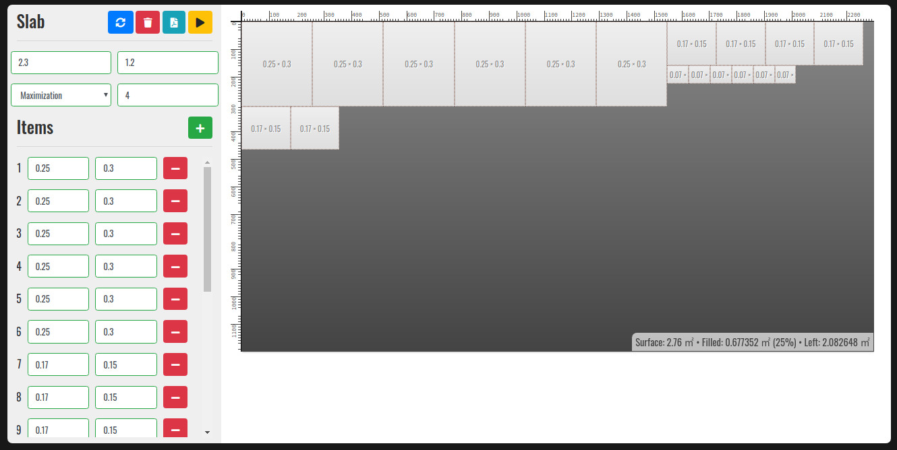

# Slab Arrangement

Web application for generating schemas with arrangements of slabs.



# How to run

Application can be run with ```php``` by executing ```php -S localhost:8080```.

# Todo

- Rewrite in React or Angular.
- Update height after window is resized.
- Docker-ize
